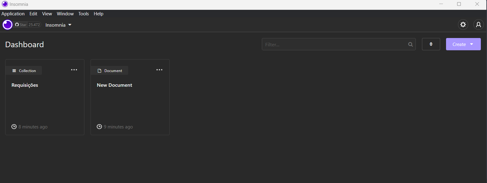
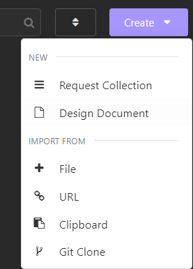
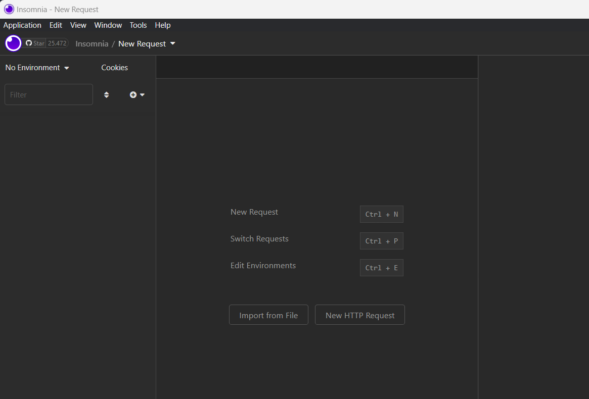
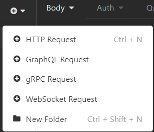
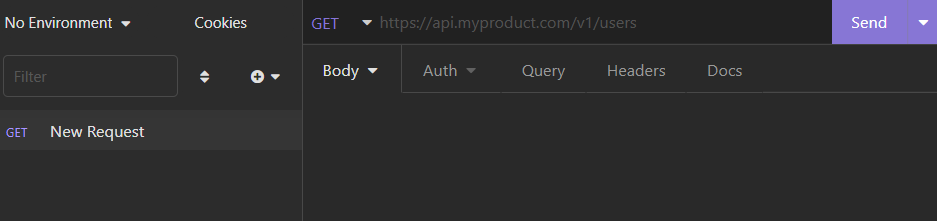

# Inicio do Projeto
Então, iniciando o projeto, após ir no site https://start.spring.io/, 
adicionar as dependências, o nome do projeto e afins. Agora vamos iniciar
nosso projeto adicionando uma `Controller` dentro da pasta:

``` Folder
src
    main
        java
            med
                voll
                    api
                        controller
                        HelloController.java
```
Neste arquivo `HelloController.java` é uma classe chamada
`HelloController`, onde precisamos indicar para o projeto
que isso é uma controladora.

# Informando que é uma controladora e mapeando requisição
Para comunicarmos o Spring MVC que é uma classe controller, acima dela incluiremos a anotação `@Controller`. Mas como trabalharemos com uma aplicação diferente da aplicação web tradicional, e sim com uma API Rest, a notação será diferente: `@RestController`.

Outra anotação que incluiremmos é a `@ResquestMapping`. Isso informará qual a URL que esse controller vai responder, que será `/hello`. Assim, ao chegar uma requisição para `localhost:8080` vai cair neste controller.

``` Java
@RestController
@RequestMapping("/hello")
public class HelloController {

}
```

Agora vamos criar um método dentro dessa classe:

```java
public String olaMundo() {
    return "Hello World!";
}
```

Com o método criado, precisamos informar para o Spring que essa classe é não só uma controller, mas também que quando chegar a requisição mapeada no `RequestMapping("/hello")` e ela for do tipo `get`, será chamado esse método `olaMundo()`.

Para informar isso, colocamos em cima do método a anotação `@GetMapping`.

```java
@GetMapping
public String olaMundo() {
    return "Hello World!";
}
```

# Como disparar requisições para nossa API
Agora vamos entender como faremos para disparar requisições, como `Get`,`Post`, `Put`, `Delete`.

No programa `Insominia`, podemos configurar uma parte para simular, como se fosse em uma aplicação Front-End toda a parte comunicação com o nosso Back-End, como se fosse os testes do nosso Back-End.



No botão `Create`:


Vamos em `Request Collection`, e depois colocando o nome da nossa Request, vamos para a tela:


Agora podemos ir no `+` e clicarmos em `HTTP Request`, ou podemos usar o comando `Ctrl + n`.



Onde podemos ao lado esquerdo renomear o nome da requisição, clicando 2 vezes em `New Request`, e podemos ao lado direito colocar a url da nossa querisição, além de podemos trocar o tipo de requisição, como se trocarmos para `Post`:



No nosso caso eu quero criar médicos, então o meu precisa ser do tipo `Post`, com a URL `http://localhost:8080/medicos`, pois como estou usando o Spring Boot, a aplicação está rodando localhost, na porta `8080`

# Fazendo mais uma controller
Agora que temos um programa pra simular nosso Front-End, temos que receber essas requisições e simular.

Para isso vamos criar a controller de médicos

``` Java
public class MedicoController {

}
```