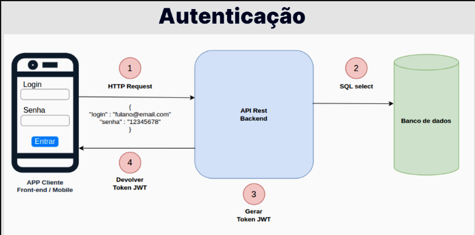
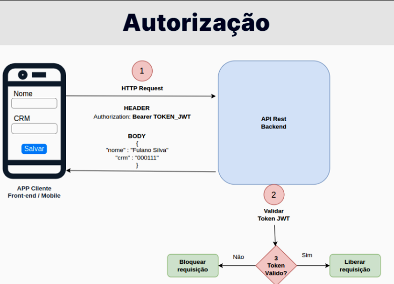

# Spring Security
O Spring contém um módulo específico para tratar de segurança, conhecido como `Spring Security`. Ele trata questões específicas relacionadas com segurança em aplicações.

Essas aplicações podem ser tanto Web quanto uma API Rest.

O Spring Security tem alguns objetivos, são eles:
- Autenticação
- Autorização (controle de acesso)
- Proteção contra ataques (CSRF, clickjacking, etc.)

Em suma, o Spring Security possui três objetivos. Um deles é providenciar um serviço para customizarmos como será o controle de `autenticação` no projeto. Ou seja, usuários efetuam login na aplicação.

O Spring Security possui, também, a `autorização`, sendo o controle de acesso para liberarmos a requisição na API ou para fazermos um controle de permissão.

Vamos dar um exemplo:

Temos uns usuários e eles possuem a permissão "A", já um outro grupo de usuários possui a permissão "B". Os usuários com a permissão "A" podem acessar as URLs, os que tiverem a permissão "B", além dessas URLs anteriores, podem acessar outras URLs.

Desta maneira, conseguimos fazer um controle de acesso ao nosso sistema.

Há também, um mecanismo de proteção contra os principais ataques que ocorre em uma aplicação, como o CSRF (Cross Site Request Forgery) e o clickjacking.

Então são esses os três principais objetivos do Spring Security, nos fornecer uma ferrramenta para implementarmos autenticação e autorização no projeto e nos proteger dos principais ataques. Isso para não precisarmos implementar o código que protege a aplicação, sendo que já temos disponível.

No caso da nossa API, o que faremos é o controle de autenticação e autorização, o `controle de acesso`.

A nossa API é pública até o momento, ou seja, qualquer um que conheça a URL, pode fazer uma requisição para a API. Porém, não queremos isso, queremos que somente os funcionários da clínica possam ter esse acesso. Mesmo que eles utilizem aplicações front-end ou aplicativo mobile, essas aplicações de clientes irão disparar requisições para a nossa API back-end, e então deve estar protegida.

Atenção:
`Autenticação em aplicação Web (Stateful)` é diferente de `Autenticação em API Rest (Stateless)`.

O processo de autenticação em uma aplicação Web tradicional `é diferente` do processso de autenticação em uma API Rest. Em uma aplicação Web, temos um conceito chamado de stateful.

Toda vez que um usuário efetua o login em uma aplicação Web, o servidor armazena o estado. Isto é, cria as sessões e, com isso, consegue identificar cada usuário nas próximas requisições. Então, o servidor armazena essas sessões, espaços em memória e cada sessão contém os dados específicos de cada usuário.

Diferente da aplicação Web, em uma API Rest, não deveríamos fazer isso, porque os conceitos é que ela seja `stateless`, não armazena estado. Caso o cliente da API dispare uma requisição, o servidor processará essa requisição e devolverá a resposta.

Na próxima requisição, o servidor não sabe identificar quem é que está enviando, ele não armazena essa sessão. Assim, o processo de autenticação funciona um pouco diferente.

Então uma das estratégias para lidarmos com a autenticação é usarmos `Tokens` e usarmos o JWT - JSON Web Tokens como protocolo padrão para lidar com o gerenciamento desses tokens - geração e armazenamento de informações nos tokens.

# Autenticação



Então esse diagrama contém um esquema do processo de autenticação na API. O Cliente da API seria um aplicativo mobile. Assim, quando o funcionário da clínica for abri o aplicativo, será exibida uma tela de login tradicional, com os campos "Login" e "Senha", com um botão "Entrar", para enviar o processo de autenticação.

Ao enviar o usuário e senha, a aplicação captura esses dados e dispara uma requisição para a API back-end - da mesma forma que enviamos pelo Isomnia.

Logo, o primeiro passo é a requisição ser disparada pelo aplicativo para a nossa API, e no corpo desta requisição é exibido o JSON com o login e senha digitados na tela de login.

O segundo passo é capturar esse login e senha e verificar se o usuário está cadastrado no sistema, isto é, teremos que consultar o banco de dados. Por isso, precisaremos ter uma tabela em que vamos armazenar os usuários e suas respectivas senhas, que podem acessar a API.

Da mesma maneira que temos uma tabela para armazenar os médicos e outra para os pacientes, teremos uma para guardar os usuários. Logo, o segundo passo do processo de autenticação é: a nossa API capturar esse login e senha, e ir ao banco de dados efetuar uma consulta para verificar a existência dos dados desse usuário.

Se for válido, a API gera um Token, que nada mais é que uma string. A geração desse Token segue o formato JWT, e esse token é devolvido na resposta para a aplicação de cliente, sendo quem disparou a requisição.

Esse é o processo de uma requisição para efetuar o login e autenticar em uma API Rest, usando tokens. Será esse processo que seguiremos

Isto é, teremos um controller mapeando a URL de autenticação, receberemos um DTO com os dados do login e faremos uma consulta no banco de dados. Se tiver tudo certo, geramos um token e devolveremos para o front-end, para o cliente que disparou a requisição.

Esse token deve ser armazenado pelo aplicativo mobile/front-end. Há técnicas para guardar isso de forma segura, porque esse token que identifica se o usuário está logado.

Assim, nas requisições seguintes entra o processo de autorização, que consta no diagrama a seguir:

# Autorização



Na requisição de cadastrar um médico, o aplicativo exibe o formulário de cadastro de médico - simplificamos no diagrama, mas considere que é um formulário completo - e após preenchermos os dados, clicamos no botão "Salvar".

Será disparada uma requisição para a nossa API - da mesma forma que fizemos no Insomnia. No entanto, além de enviar o JSON com os dados do médico no corpo da resposta, a requisição deve incluir um cabeçalho chamado authorization. Neste cabeçalho, levamos o token obtido no processo anterior, de login.

A diferença será essa: todas as URLs e requisições que desejarmos proteger, teremos que validar se na requisição está vindo o cabeçalho `authorization` com um token. E precisamos validar este token, gerado pela nossa API.

Portanto, o processo de autorização é: primeiro, chega uma requisição na API e ela lê o cabeçalho authorization, captura o token enviado e valida se foi gerado pela API. Teremos um código para verificar a validade do token.

Caso não seja válido, a requisição é interrompida ou bloqueada. Não chamamos o controller para salvar os dados do médico no banco de dados, devolvemos um erro 403 ou 401. Há protocolos HTTP específicos para esse cenário de autenticação e autorização.

Pelo fato do token estar vindo, o usuário já está logado. Portanto, o usuário foi logado previamente e recebeu o token. Este token informa se o login foi efetuado ou não. Caso seja válido, seguimos com o fluxo da requisição.

O processo de autorização funciona assim justamente porque a nossa API deve ser Stateless. Ou seja, não armazena estado e não temos uma sessão informando se o usuário está logado ou não. É como se em cada requisição tivéssemos que logar o usuário.

Assim, nas próximas requisições o aplicativo leva na requisição, além dos dados em si, o token. Logo, não é necessário mandar login e senha, somente o token. E nesta string, contém a informação de quem é esse usuário e, com isso, a API consegue recuperar esses dados.

Essa é uma das formas de fazer a autenticação em uma API Rest.

Caso já tenha aprendido a desenvolver uma aplicação Web tradicional, o processo de autenticação em uma API Rest é diferente. Não possui o conceito de sessão e cookies, é stateless - cada requisição é individual e não armazena o estado da requisição anterior.

Como o servidor sabe se estamos logados ou não? O cliente precisa enviar alguma coisa para não precisarmos enviar login e senha em toda requisição. Ele informa o login e a senha na requisição de logar, recebe um token e nas próximas ele direciona esse mesmo token.

`Tipos de autenticação`: https://www.alura.com.br/artigos/tipos-de-autenticacao

# Implementando o Spring Security
Para implementarmos o Spring Security o primeiro passo é a configuração no `pom.xml`.

Então podemos pegar as `dependency` do próprio site do Spring: https://start.spring.io/

Configurando o projeto para `maven`, indo em `add dependencies` e pesquisando por Spring Security, após adicionar, podemos ir em `Explore` e olhar o `pom.xml`, no nosso caso vamos adicionar as seguintes dependências: `spring-boot-starter-security` e `spring-security-test`.

``` xml
<dependency>
    <groupId>org.springframework.boot</groupId>
    <artifactId>spring-boot-starter-security</artifactId>
</dependency>

<dependency>
    <groupId>org.springframework.security</groupId>
    <artifactId>spring-security-test</artifactId>
    <scope>test</scope>
</dependency>
```

Agora que adicionamos, o ideal é reiniciarmos toda a aplicação. Após reiniciar, no log de iniciação, vamos diferença, temos um `Using generated security password`.

Ou seja, ele nos informa que gerou uma senha aleatória e em seguida nos passa a senha.

A seguir ele também nos informa que a senha gerada é somente para ambiente de desenvolvimento, e que não devemos usar em ambiente de produção

Ao adicionar esse Spring Security como dependência do projeto, ele gera uma configuraçção padrão, criando um usuário e senha e exibindo no log. E, também, faz uma alteração no projeto, bloqueando todas as requisições, portanto se formos no Insomnia e tentarmos listar os médicos, não iremos conseguir, pois receberemos o erro `401 Unauthorized`.

Então todas as requisições estão sendo bloqueadas pelo Spring Security. Portanto, esse é o comportamento padrão do Spring Security ao adicioná-lo como dependência no projeto, ele bloqueia tudo e gera uma senha aleatória.

Para podermos usar as requisições, precisamos usar a Web, então vamos na URL `localhost:8080` e veremos que o Spring Security adicionou uma tela de login e, é nela que iremos utilizar o usuário e senha do Spring Security.

```
Username: user
Password: a senha autogerada no console do Spring
```

Então depois de efetuar o login e ir por exemplo na URL para listar os médicos `localhost:8080/medicos`, vamos conseguir visualizar o retorno do JSON.

Portanto, esse é o comportamento padrão do Spring Security: ele bloqueia todas as URLs, disponibiliza um formulário de login - que e possui um usuário padrão chamado user e a senha devemos copiar do console ao inicializar o projeto.

Contudo, no nosso projeto não é exatamente isso que desejamos. Esse comportamento padrão funciona para aplicações Web, que trabalha no modelo de stateful. Porém, estamos trabalhando com uma API Rest, em que a autenticação será feita no modelo stateless.

## Começando os códigos
Primeiramente para autenticar o usuário na API, precisamos ter uma tabela no banco de dados em que serão armazenados os usuários e suas respectivas senhas. Essa é uma das modificações que vamos faazer no projeto.

Então precisamos representar esse conceito de usuário no código, como estamos usando a JPA, criaremos uma entidade JPA para simbolizar esse usuário, então como estamos utilizando a JPA, vamos criar uma entidade JPA para simbolizar esse usuário e temos que gerar a tabela no banco de dados.

Então no arquivo `domain` em src-> main-> java-> domain-> criaremos um novo pacote chamado `usuario`, dentro dele criaremos a classe `Usuario`

``` Java
public class Usuario {

    private Long id;
    private String nome;
    private String senha;
}
```

Agora precisamos colocar as anotações de uma entidade JPA:

``` Java
@Entity(name = "usuario")
@Table(name = "usuario")
@Getter
@NoArgsConstructor
@AllArgsConstructor
@EqualsAndHashCode(of = "id")
public class Usuario {

    @Id
    @GeneratedValue( strategy = GenerationType.IDENTITY )
    private Long id;
    private String nome;
    private String senha;
}
```

Agora com a entidade JPA criada, precisamos criar a tabela de usuários, para isso criaremos uma nova migration no arquivo src-> main-> java-> resources, criaremos a migration `V7__create-table-usuarios.sql` e dentro dela colocaremos a criação da tabela.

``` SQL
CREATE TABLE usuarios (
    id SERIAL NOT NULL,
    login VARCHAR(100) NOT NULL,
    senha VARCHAR(255) NOT NULL,

    PRIMARY KEY(id)
);
```

## Hashing de senha
Antes de continuarmos com os códigos vamos entender o coneito de Hashing de senha.

Ao implementar uma funcionalidade de autenticação em uma aplicação, independente da linguagem de programação utilizada, você terá que lidar com os dados de login e senha dos usuários, sendo que eles precisarão ser armazenados em algum local, como, por exemplo, um banco de dados.

Senhas são informações sensíveis e não devem ser armazenadas em texto aberto, pois se uma pessoa mal intencionada conseguir obter acesso ao banco de dados, ela conseguirá ter acesso às senhas de todos os usuários. Para evitar esse problema, você deve sempre utilizar algum algoritmo de hashing nas senhas antes de armazená-las no banco de dados.

Hashing nada mais é do que uma função matemática que converte um texto em outro texto totalmente diferente e de difícil dedução. Por exemplo, o texto Meu nome é Rodrigo pode ser convertido para o texto 8132f7cb860e9ce4c1d9062d2a5d1848, utilizando o algoritmo de hashing MD5.

Um detalhe importante é que os algoritmos de hashing devem ser de mão única, ou seja, não deve ser possível obter o texto original a partir de um hash. Dessa forma, para saber se um usuário digitou a senha correta ao tentar se autenticar em uma aplicação, devemos pegar a senha que foi digitada por ele e gerar o hash dela, para então realizar a comparação com o hash que está armazenado no banco de dados.

Existem diversos algoritmos de hashing que podem ser utilizados para fazer essa transformação nas senhas dos usuários, sendo que alguns são mais antigos e não mais considerados seguros hoje em dia, como o MD5 e o SHA1. Os principais algoritmos recomendados atualmente são:

- Bcrypt
- Scrypt
- Argon2
- PBKDF2

## Repository e Service
Anteriormente criamos a entidade JPA e a migration. Agora vamos criar outras classes no projeto, por exemplo, o repository. Isso porque, em geral, cada entidade JPA terá uma interface repository, sendo quem faz o acesso ao banco de dados.

Criaremos o repository do usuário, no pacote `usuario`, o nome do repository será `UsuarioRepository`.

``` Java
public interface UsuarioRepository {

}
```

Por ser um repository precisamos herdar, por isso, acrescentaremos `extends JpaRepository`.

``` Java
public interface UsuarioRepository extends JpaRepository {

}
```

Logo após a interface JpaRepository, vamos abrir e fechar um sinal de `<>`, os *generics*. Dentro dos generics passaremos os dois tipos: quem é a entidade e o tipo de chave primária.

No caso, a entidade é o `Usuario` e o tipo da chave é `Long`, para representar os IDs.

``` Java
public interface UsuarioRepository extends JpaRepository<Usuario, Long>{

}
```
Sempre que precisaremos consultar a tabela de usuários no banco de dados, usaremos o `UsuarioRepository`. Além disso, vamos crair algumass classes de configurações para o Spring Security.

Nessa parte de autenticação, o Spring Security detecta algumas coisas de forma automática no projeto. Por exemplo, a classe que vai a lógica de usar o repository e acessar o banco de dados para realizar a consulta.

O Spring possui um comportamento padrão, ele procura por uma classe específica no projeto. Portantoo, precisamos criar essa classe seguindo o padrão Spring e, com isso, ele consegue identificá-la no projeto e usá-la para o processo de autenticação.

Para isso funcionar, vamos criar uma classe dentro do pacote `usuário`, com o nome `AutenticacaoService`.

``` Java
public class AutenticacaoService {

}
```

Esta classe terá o código com a lógica de autenticação no projeto.

Para o Spring identificar essa classe, usamos a anotação ``@Service` em cima da classe.

A anotação `@Service` serve para o Spring identificar essa classe como um comportamento do tipo serviço. Isto é, ela executará algum serviço no projeto, no caso, será o de autenticação. Assim, o Spring carrega a classe e executa o serviço ao inicializarmos o projeto.

``` Java
@Service
public class AutenticacaoService {

}
```

O Spring Security também precisa ser informado que esta classe é a responsável pelo serviço de autenticação. Para isso, teremos que implementar uma interface.

Portanto, na assinatura da classe, antes de abrir as chaves vamos digitar `implements UserDetailsService`. Sendo `userDetailsService` uma interface do Spring Security.

``` Java
@Service
public class AutenticacaoService implements UserDetailsService {

}
```

Com isso, o Spring será o responsável por chamar essa classe. Não injetaremos a classe `AutenticacaoService` em nenhum controller, o Spring consegue identificá-la e chamá-la quando ocorrer o processo de autenticação.

Isso desde que ela possua a anotação `@Service` e implemente a interface `UserDetailsService`, própria do Spring Security. **Agora precisamos implementar os métodos dessa interface**.

``` Java
@Service
public class AutenticacaoService implements UserDetailsService {

    @Override
    public UserDetails loadUserByUsername(String username) throws UsernameNotFoundException {
        return null;
    }
}
```
Precisamos detalhar somente um método na classe dessa interface. No caso, o `load User By Username`, sendo o método que o Spring chama de forma automática ao efetuarmos o login.

Com isso, quando o usuário efetuar o login, o Spring busca pela classe `AutenticacaoService` - por ser responsável por implementar a `UserDetailsService` - e chama o método `loadUserByUsername`, passando o 
`username` digitado no formulário de login.

Precisamos devolver alguma coisa, em vez de `null`, precisamos acessar o banco de dados, ou seja, usaremos o repository. Logo, vamos injetar o repository como uma dependência da classe.

Para isso, acima do método `loadUserByUsername` vamos declara o atributo `private UsuarioRepository` nomeando como repository.

``` Java
@Service
public class AutenticacaoService implements UserDetailsService {

    @Autowired
    private UsuarioRepository repository;

    @Override
    public UserDetails loadUserByUsername(String username) throws UsernameNotFoundException {
        return null;
    }
}
```

Para injetarmos a dependência na classe, usaremos a anotação `@Autowired` ou podemos usar o Lombok para gerar um construtor com esse atributo.

Agora precisamos alterar o retorno `null` para repository no método `loadUserByUsername`. Na sequência incluímos o método `findByLogin()`, passando como parâmetro o `username`.

``` Java
@Service
public class AutenticacaoService implements UserDetailsService {

    @Autowired
    private UsuarioRepository repository;

    @Override
    public UserDetails loadUserByUsername(String username) throws UsernameNotFoundException {
        return repository.findByLogin(username);
    }
}
```

Agora precisamos criar esse método `findByLogin` na interface `UsuarioRepository`. Neste método, vamos alterar o parâmetro de `username` para login.

``` Java
public interface UsuarioRepository extends JpaRepository<Usuario, Long> {
    UserDetails findByLogin(String login);
}
```

O `findByLogin()` é o método responsável por realizar a consulta do usuário no banco de dados. Portanto, será usado em `AutenticacaoService`.

## Configurações de segurança
Agora vamos configurar o Spring Security para ele não usar o processo de segurança tradicional, o *stateful*. Como estamos trabalhando com uma API Rest, o processo de autenticação **precisa ser stateless**.

Então dentro de infra (src -> main -> java -> med.voll.api -> infra). Dentro do pacote `infra`, já que é uma configuração de infraestrutura de segurança vamos ciar uma classe.

Então criaremos uma sub-package chamada `security` com uma classe chamada `SecurityConfigurations`.

``` Java
public class SecurityConfigurations {

}
```
É nesta classe que vamos concentrar as informações de segurança do Spring Security. Por enquanto, é uma classe java e o Spring não carrega essa classe no projeto, dado que não temos nenhuma anotação dela.

Por ser uma classe de configurações, usaremos a anotação `@Configuration`.

``` Java
@Configuration
public class SecurityConfigurations {

}
```
Desse modo, o Spring identifica a classe e a carrega no projeto.

Como faremos as configurações de segurança, personalizando o processo de autenticação e autorização, adicionaremos mais uma anotação.

No caso, usaremos uma do Spring Security, sendo a `@EnableWebSecurity`. Isso para informarmos ao Spring que vamos personalizar as configurações de segurança.

``` Java
@Configuration
@EnableWebSecurity
public class SecurityConfigurations {

}
```

Dentro da classe, vamos incluir a configuração do processo de autenticação, que precisar ser stateless. Para isso, criaremos um método cujo retorno será um objeto chamado `SecurityFilterChain`, do próprio Spring.

O objeto `SecurityFilterChain` do Spring é usado para configurar o processo de autenticação e autorização.

Por isso, no bloco da classe, vamos digitar o método `public SecurityFilterChain` nomeado `securityFilterChain()`.

``` Java
@Configuration
@EnableWebSecurity
public class SecurityConfigurations {

    public SecurityFilterChain securityFilterChain() {

    }
}
```
Agora precisamos devolver um objeto `securityFilterChain`, contudo, não vamos instanciar esse objeto. Nos parênteses do método, receberemos a classe `HttpSecurity`, do Spring, e o chamaremos de http.

``` Java
@Configuration
@EnableWebSecurity
public class SecurityConfigurations { 

    public SecurityFilterchain securityFilterChain(HttpSecurity http) {

    }
}
```

Agora vamos fazer o retorno, `return http`, temos o método `http.build()`, sendo quem cria o objeto `securityFilterChain`.

Mas antes precisamos fazer algumass configurações, no `return` digitaremos `http.csrf().disable()`. Serve para desabilitarmos proteção contra ataques do tipo Cross-Site Request Forgery, pois o nosso `Token` já cuida desse tipo de ataque, então seria redundante fazer o nosso security cuidar desse ataque também.

``` Java
@Configuration
@EnableWebSecurity
public class SecurityConfiguration {
    public SecurityFilterChain securityFilterChain(HttpSecurity http) {
        return http.csrf().disable()
    }
}
```

Após o `disable()` colocamos o método `.sessionManagement()` para mostrar o gerenciamento da sessão. Na sequência, mais um ponto e o método `sessionCreationPolicy()`, qual a politica de sessão.


``` Java
public SecurityFilterChain securityFilterChain(HttpSecurity http) {
    return gttp.csrf().disable().sessionManagement().sessionCreationPolicy()
}
```

No método `sessionCreationPolicy()`, passamos como parâmetro um objeto. Temos um atributo estático na própria classe `SessionCreationpolicy`, que ao digitarmos no parâmetro virá com `.ALWAYS`, e alteramos para `.STATELESS`.

``` Java
public SecurityFilterChain securityFilterChain(HttpSecurity http) {
    return gttp.csrf().disable().sessionManagement().sessionCreationPolicy(SessionCreationPolicy.STATELESS)
}
```
após `SessionCreationPolicy()` vamos pedir pra ele criar o objeto `SecurityFilterChain`, com `.and().build()`. Mas também precisamos nos atentar pois esse o método `csrf()` lança uma exception, logo vamos lançar no método.

Por isso, na assinatura do método `securityFilterChain` antes de abrirmos as chaves, vamos inserir `throws Exception`. Ou seja, se der alguma exceção é para lançar.

``` Java
public SecurityFilterChain securityFilterChain(HttpSecurity http) throws Exception {
    return http.csrf().disable().sessionManagement().sessionCreationPolicy(SessionCreationPolicy.STATELESS).and().build();
}
```

Então nessa primeira configuração desta classe estamos desabilitando o tratamento contra-ataque CSRF e, na sequência, desabilitando o processo de autenticação padrão do Spring. Isso porque estamos usando uma API Rest, e queremos que seja *stateless*.

Faltou adicionarmos uma anotação, pois o Spring não lê o método de forma automática, então precisamos adicioná-la, a anotação é `@Bean`, que serve para exibir o retorno desse método, que estamos devolvendo um objeto `SecurityFilterChain`.

Então para devolvermos um objeto para o Spring, usamos a anotação `@Bean`.

``` Java
@Bean
public SecurityFilterChain securityFilterChain(HttpSecurity http) throws Exception {
    return http.csrf().disable().sessionManagement().sessionCreationPolicy(SessionCreationPolicy.STATELESS).and().build();

}
```
## Controller de Autenticação
Então o esquema da nossa API é receber uma requisição e validar no banco de dados. Caso o usuário esteja cadastrado, é gerado o token como resposta. Esse é o fluxo de autenticação que precisamos implementar no projeto.

Portanto, a auteração que faremos é implementar o **tratamento dessa requisição**. Precisamos ter um controller para receber essas requisições, responsável por autenticar o usuário no sistema.

Então, criando o arquivo `AutenticacaoController`:

``` Java
public class AutenticacaoController {

}
```

Agora, precisamos incluir alguma anotação para o Spring reconhecer essa classe. No caso é uma classe controller, portanto, usaremos a anotação `@RestController`.

Também precisamos colocar mais uma anotação, que é a `RequestMapping()`. Nesta, precisamos passar qual a URL que o controller vai tratar, no caso será `/login`.

Portanto, ao chegar uma requsição na nossa API para `/login`, o Spring identifica que deve chamar este controller.

``` Java
@RestController
@RequestMapping("/login")
public class AutenticacaoController {

}
```

Dentro da classe precisamos construir um método chamado `efetuarLogin` para receber essa requisição. Também precisamos incluir uma anotação no método, informando qual o verbo do protocolor HTTP. Por ser uma requisição que estamos recebendo informações, usaremos o verbo `post` e a anotação será o `@PostMapping`.

``` Java
@PostMapping
public ResponseEntity efetuarLogin() {

}
```

No parênteses do método `efetuarLogin()`, vamos receber um DTO com os dados que serão enviados pelo aplicativo front-end: `DadosAutenticacao dados`.

Lembrando que esse parâmetro precisa ser anotado com `@RequestBody`, já que virá no corpo da requisição. E também, o `@Valid` para validarmos os campos com o *bean validation*.

``` Java
@PostMapping
public ResponseEntity efetuarLogin(@RequestBody @Valid DadosAutenticacao dados) {

}
```

Precisamos criar a `classe Record` de `DadosAutenticacao`, pois até o momento ela não existe.

``` Java
public record DadosAutenticacao() {

}
```

No parêntese do `record`, incluiremos dois campos: login e senha, sendo String.

``` Java
public record DadosAutenticacao(String login, String senha) {

}
```

Agora, com o DTO criado, precisamos consultar o banco de dados e disparar o processo de autenticação.

O processo de autenticação está na classe `AutenticacaoService`. Precisamos chamar o método `loadUserByUsername`, já que é ele que usa o `repository` para efetuar o `select` no banco de dados.

Porém, não chamamos a classe `service` de forma direta no Spring Security. Temos outra classe do Spring que chamaremos e é ela que vai chamar a `AutenticacaoService`.

No arquivo do controller, precisamos usar a classe `AuthenticationManager` do Spring, responsável por disparar o processo de autenticação.

Vamos declarar o atributo na classe `AutenticacaoController`. Será privado, e chamaremos de `manager`. Acima, incluiremos a anotação `@Autowired`, para solicitar ao Spring a injeção desse parâmetro. Não somos nós que vamos instanciar esse objeto, e sim o Spring.

``` Java
@Autowired
private AuthenticationManager manager;
```

Dentro de `efetuarLogin()` utilizaremos o método `.authenticate()` chamando o objeto `manager`. No método `authenticate()`, precisamos passar um objeto do tipo *username authentication token*.

``` Java
manager.authenticate(token);
```

Logo após vamos guardar o objeto `token` em uma variável.

``` Java
var authentication = manager.authenticate(token);
```

Este método devolve o objeto que representa o usuário autenticado no sistema.

``` Java
@RestController
@RequestMapping("/login")
public class AutenticacaoController {

    @Autowired
    private AuthenticationManager manager;

    @PostMapping
    public ResponseEntity efetuarLogin(@RequestBody @Valid DadosAutenticacao dados) {        
        var autentication = manager.authenticate(token);
    }
}
```

Vamos criar a variável `token`. Esse token é o login e senha, e já está sendo representado no DTO `DadosAutenticacao`. No entanto, esse DTO não é o parâmetro esperado pelo Spring, ele espera uma classe dele próprio - e não uma classe do projeto.

Portanto, na variável `token` criaremos a classe que representa o usuário e senha.

``` Java
var token = new UsernamePasswordAuthenticationToken(dados.login(), dados.senha());
```

Então colocamos o `new UsernamePasswordAuthenticationToken()` passando como parâmetro o DTO, sendo `dados.login()`, e `dados.senha()`.

Temos o nosso DTO e o Spring contém um próprio, também. O método `authenticate(token)`  recebe o DTO do Spring. Por isso, precisamos converter para `UsernamePasswordAuthenticationToken` - como se fosse um DTO do próprio Spring.

``` Java
@RestController
@RequestMapping("/login")
public class AutenticacaoController {

    @Autowired
    private AuthenticationManager manager;

    @PostMapping
    public ResponseEntity efetuarLogin(@RequestBody @Valid DadosAutenticacao dados) {
        var token = new UsernamePasswordAuthenticationToken(dados.login(), dados.senha());
        var authentication = manager.authenticate(token);        
    }
}
```

E precisamos fazer o retorno, então faremos um `.ok().build()` para recebermos um código `200 OK` quando a requisição for efetuada com sucesso.

``` Java
return ResponseEntity.ok().build();
```

``` Java
@RestController
@RequestMapping("/login")
public class AutenticacaoController {

    @Autowired
    private AuthenticationManager manager;

    @PostMapping
    public ResponseEntity efetuarLogin(@RequestBody @Valid DadosAutenticacao dados) {
        var token = new UsernamePasswordAuthenticationToken(dados.login(), dados.senha());
        var authentication = manager.authenticate(token);

        return ResponseEntity.ok().build();        
    }
}
```
Com isso, temos o nosso controller responsável pelo processo de autenticação.

Contudo, ainda precisamos fazer mais auterações, pois do jeito que está o nosso projeto ainda não está pronto, receberíamos um erro que significaria que o campo `manager` na classe `Autenticacao Controller` requer um bean do tipo `Authentication Manager`, que não pôde ser encontrado.

Isto é, no momento de carregar o `AutenticacaoController`, ele não encontrou o `AuthenticationManager`. Não conseguiu injetar o atributo `manager` na classe controller.

A classe `AuthenticationManager` é do Spring. Porém, ele não injeta de forma automática o objeto `AuthenticationManager`, precisamos configurar isso no Spring Security. Como não configuramos, ele não cria o obejto `AuthenticationManager` e lança uma exceção.

Então vamos fazer essa configuração.

Por ser uma configuração de segurança, faremos essa alteração na classe `SecurityConfigurations`.

``` Java
@Configuration
@EnableWebSecurity
public class SecurityConfigurations {

    @Bean
    public SecurityFilterChain securityFilterChain(HtppSecurity http) throws Exception {
        return http.csrf().disable().sessionManagement().sessionCreationPolicy(SessionCreationPolicy.STATELESS).and().build();
    }
}
```

Vamos criar um método após o `securityFilterChain`, cujo retorno é o objeto `AuthenticationManager` e o nome será `authenticationManager`.

``` Java
public AuthenticationManager authenticationManager()
```

No parênteses deste método, receberemos um objeto do tipo `AuthenticationConfiguration` chamado `configuration`.

``` Java
public AuthenticationManager authenticationManager(AuthenticationConfiguration configuration) {
    
}
```

No retorno, teremos `configuration.getAuthenticationManager()`.

``` Java
public AuthenticationManager authenticationManager(AuthenticationConfiguration configuration) {

    return configuration.getAuthenticationManager();
}
```

A classe `AuthenticationConfiguration`, possui o método `getAuthenticationManager()` que cria o objeto `AuthenticationManager`. Portanto, usaremos essa classe.

Esse método `getAuthenticationManager()` precisa lançar uma *exception*, então vamos incluir o `throws Exception`.

``` Java
@Bean
public AuthenticationManager authenticationManager(AuthenticationConfiguration configuration) throws Exception{

    return configuration.getAuthenticationManager();
}
```
Esse é o método que estamos informando ao Spring como injetar objetos. Portanto, acima dele incluiremos a anotação `@Bean`.

```
A anotação @Bean serve para exportar uma classe para o Spring, fazendo com que ela consiga carregá-la e realizar a sua injeção de dependência em outras classes.
```

Desse modo, informamos ao Spring como criar um objeto `AuthenticationManager`. Agora o nosso projeto já deve iniciar corretamente.

Assim, criamos o nosso controller de autenticação e já conseguiremos disparar uma requisição para efetuar o login no sistema.

No Isomnia podemos testar criando uma nova requisição do tipo `post` com a URL `http://localhost:8080/login`, sendo a URL que configuramos na classe `AutenticacaoController`.

Porém, não possuímos nenhum login registrado no nosso banco de dados, então vamos criar:

``` SQL
INSERT INTO usuarios VALUES('gabriel.fabricio@voll.med', '$2a$10$Y50UaMFOxteibQEYLrwuHeehHYfcoafCopUazP12.rqB41bsolF5.');
```

Mas temos que nos atentar a um detalhe, anteriormente comentamos sobre o algoritmo de hashing de senhas. Onde, senhas não poderiam ser guardadas como `123456` e precisariamos guardar como um hashing.

Então usamos o algoritmo BCrypt. Contudo, no banco de dados estamos usando o formato BCrypt de hashing de senha. Como o Spring identifica que estamos usando o BCryot? Precisamos fazer essa configuração.

Por ser uma configuração de segurança, voltamos ao arquivo `SecurityConfigurations`.

Criaremos mais um método usando a anotação `@Bean`. Será público e devolve um objeto do tipo `PasswordEncoder`, sendo a classe que representa o algoritmo de hashing da senha.

``` Java
@Bean
public PasswordEncoder passwordEncoder() {

}
```
O método não receberá nenhum parâmetro, somente retornaremos um novo `BCryptPasswordEncoder()`, sendo uma classe do Spring para instanciarmos como se fosse uma classe Java.

``` Java
@Bean
public PasswordEncoder passwordEncoder() {
    return new BCryptPasswordEncoder();
}
```

Com isso, condiguramos o Spring para usar esse algoritmo de hashing de senha.

Então o arquivo `SecurityConfigurations` ficou da seguinte forma:

``` Java
package med.voll.api.infra.security;

import org.springframework.context.annotation.Bean;
import org.springframework.context.annotation.Configuration;
import org.springframework.security.authentication.AuthenticationManager;
import org.springframework.security.config.annotation.authentication.configuration.AuthenticationConfiguration;
import org.springframework.security.config.annotation.web.builders.HttpSecurity;
import org.springframework.security.config.annotation.web.configuration.EnableWebSecurity;
import org.springframework.security.config.http.SessionCreationPolicy;
import org.springframework.security.crypto.bcrypt.BCryptPasswordEncoder;
import org.springframework.security.crypto.password.PasswordEncoder;
import org.springframework.security.web.SecurityFilterChain;

@Configuration
@EnableWebSecurity
public class SecurityConfigurations {
    
    @Bean
    public SecurityFilterChain securityFilterChain(HttpSecurity http) throws Exception{
        return http.csrf().disable().sessionManagement().sessionCreationPolicy(SessionCreationPolicy.STATELESS).and().build();
    }

    @Bean
    public AuthenticationManager authenticationManager(AuthenticationConfiguration configuration) throws Exception{
        return configuration.getAuthenticationManager();
    }

    @Bean
    public PasswordEncoder passwordEncoder() {
        return new BCryptPasswordEncoder();
    }
}
```

Agora fazendo o login no Insomnia com o Json:

``` Json
{
    "login" : "gabriel.fabricio@voll.med",
    "senha" : "123456"
}
```

recebemos o código `500 Internal Server Error`. Isso aconteceu porque precisamos implementar uma interface para o Spring Security na classe usuário.

Classe `Usuario:`

``` Java
package med.voll.api.domain.usuario;

import jakarta.persistence.*;
import lombok.AllArgsConstructor;
import lombok.EqualsAndHashCode;
import lombok.Getter;
import lombok.NoArgsConstructor;

@Table(name = "usuarios")
@Entity(name = "Usuario")
@Getter
@NoArgsConstructor
@AllArgsConstructor
@EqualsAndHashCode(of = "id")

public class Usuario {

    @Id 
    @GeneratedValue(strategy = GenerationType.IDENTITY)
    private Long id;
    private String login;
    private String senha;

}
```

Para o Spring Security identificar a classe usuário do nosso projeto, precisamos informar. Por exemplo, como ele vai saber que o atributo login é o campo login? A forma para identificarmos isso é usando uma interface.

Portanto, precisamos implementar uma interface chamada `UserDetails` na classe que representa o usuário.

``` Java
public class Usuario implements UserDetails {

    @Id 
    @GeneratedValue(strategy = GenerationType.IDENTITY)
    private Long id;
    private String login;
    private String senha;
}
```

Por ser uma interface, precisamos implementar os métodos.

``` Java
@Override
public Collection<? extends GrantedAuthority> getAuthorities() {
            return null;
}

@Override
public String getPassword() {
    return null;
}

@Override
public String getUsername() {
    return null;
}

@Override
public boolean isAccountNonExpired() {
    return false;
}

@Override
public boolean isAccountNonLocked() {
    return false;
}

@Override
public boolean isCredentialsNonExpired() {
    return false;
}

@Override
public boolean isEnabled() {
    return false;
}
```

Precisamos notar que há alguns objetos que devolvem dados do tipo `boolean`, todos estão com o retorno como `false`. Alteraremos todos para `true`.

``` Java
@Override
public Collection<? extends GrantedAuthority> getAuthorities() {
            return null;
}

@Override
public String getPassword() {
    return null;
}

@Override
public String getUsername() {
    return null;
}

@Override
public boolean isAccountNonExpired() {
    return true;
}

@Override
public boolean isAccountNonLocked() {
    return true;
}

@Override
public boolean isCredentialsNonExpired() {
    return true;
}

@Override
public boolean isEnabled() {
    return true;
}
```

No `isCredentialsNonExpired()` é caso quisermos controlar a conta do usuário: se há uma data de expiração ou se pode ter as credenciais bloqueadas. No caso, não faremos esse controle de conta, portanto, vamos devolver tudo como verdadeiro.

Isso para comunicar ao Spring que o usuário não está bloqueado, está habilitado e a conta não expirou. Assim, retornamos tudo `true`. Caso queira controlar isso, basta criar os atributos e retornar os atributos específicos que representam essas informações.

No método `getUsername()`, devolveremos qual atributo da classe representa o `Username`. Por isso, ao invés de retornar `null`, vamos devolver o `login`. A mesma lógica, vamos aplicar para o método `getPassword()`.

``` Java
@Override
public String getPassword(){
    return senha;
}

@Override
public String getUsername() {
    return login;
}
```

Assim, informamos ao Spring que o `getUsername` é o atributo login, e que o `getPassword` é o atributo senha.

No primeiro método criado, precisamos devolver um obejto do tipo `Collection` chamado `getAuthorities`. Caso tenhamos um controler de permissão no projeto, por exemplo perfis de acesso, é necessário criar uma classe que represente esses perfis.

No nosso caso, não controlamos os perfis. Se o usuário estiver cadastrado, pode acessar qualquer tela sem restrições. Mas precisamos devolver para o Spring uma coleção representando os perfis.

Para isso, vamos simular uma coleção para compilarmos o projeto. Não usaremos, mas devolveremos um objeto válido para o Spring.

No retorno, ao invés de `null`, vamos inserir `List.of()`. Dentro do parêntese, criaremos um objeto do tipo `new SimpleGrantedAthority()`,
sendo a classe do Spring que informa qual o perfil do usuário.

Passaremos um perfil estático, em `SimpleGrantedAuthority()`. Por padrão, os perfis do Spring possui um prefixo, `Role_`, e o nome do perfil. No caso, será `USER`.

``` Java
@Override
public Collection<? extends GrantedAuthority> getAuthorities() {
    return List.of(new SimpleGrantedAuthority("ROLE_USER"));
}
```

Com isso, informamos ao Spring que o perfil desse usuário é fixo, e se chama *role user*.

Desta maneira, a classe `Usuario` fica da seguinte forma:

``` Java
package med.voll.api.domain.usuario;

import java.util.Collection;
import java.util.List;

import org.springframework.security.core.GrantedAuthority;
import org.springframework.security.core.authority.SimpleGrantedAuthority;
import org.springframework.security.core.userdetails.UserDetails;

import jakarta.persistence.Entity;
import jakarta.persistence.GeneratedValue;
import jakarta.persistence.GenerationType;
import jakarta.persistence.Id;
import jakarta.persistence.Table;
import lombok.AllArgsConstructor;
import lombok.EqualsAndHashCode;
import lombok.Getter;
import lombok.NoArgsConstructor;

@Entity(name = "usuarios")
@Table(name = "usuarios")
@Getter
@NoArgsConstructor
@AllArgsConstructor
@EqualsAndHashCode(of = "id")
public class Usuario implements UserDetails {

    @Id
    @GeneratedValue(strategy = GenerationType.IDENTITY)
    private Long id;
    private String login;
    private String senha;

    @Override
    public Collection<? extends GrantedAuthority> getAuthorities() {
        return List.of(new SimpleGrantedAuthority("ROLE_USER"));
    }

    @Override
    public String getPassword() {
        return senha;
    }

    @Override
    public String getUsername() {
        return login;
    }

    @Override
    public boolean isAccountNonExpired() {
        return true;
    }

    @Override
    public boolean isAccountNonLocked() {
        return true;
    }

    @Override
    public boolean isCredentialsNonExpired() {
        return true;
    }

    @Override
    public boolean isEnabled() {
        return true;
    }
}
```

Agora conseguiremos fazer o login normalamente.